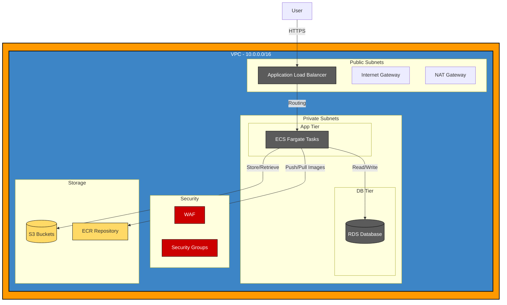

# BlakkBrotherInc - AWS Infrastructure as Code

[](https://www.terraform.io/)
[](https://aws.amazon.com/)
[](https://opensource.org/licenses/MIT)
[](https://en.wikipedia.org/wiki/Infrastructure_as_code)

## Project Overview

This project implements a secure, scalable, and highly available AWS infrastructure using Terraform. The infrastructure is designed to host containerized applications using AWS ECS (Elastic Container Service) with Fargate, following AWS best practices for security, networking, and scalability.

## Architecture



The infrastructure is built with a modular approach, separating concerns into distinct modules:

1. **Storage Module** - S3 buckets for application data and logs
2. **Networking Module** - VPC, subnets, route tables, internet gateway, and NAT gateway
3. **Security Module** - Security groups, WAF configuration, and network ACLs
4. **IAM Module** - IAM roles and policies for secure service access
5. **Compute Module** - ECS cluster, ECR repository, ALB, and jump server

### Network Architecture

- **VPC** with CIDR block `10.0.0.0/16`
- **3-Tier Architecture**:
  - Public subnets (Web tier) for ALB
  - Private subnets (App tier) for ECS tasks
  - Private subnets (DB tier) for future database implementation
- **NAT Gateway** for outbound internet access from private subnets
- **Internet Gateway** for inbound/outbound internet access from public subnets

### Security Features

- **Web Application Firewall (WAF)** for protecting against common web exploits
- **Security Groups** with principle of least privilege
- **HTTPS** enforcement with HTTP to HTTPS redirection
- **Private subnets** for application workloads
- **Jump Server** for secure administrative access

### Compute Resources

- **ECS Cluster** with Fargate launch type for containerized applications
- **Application Load Balancer** for distributing traffic
- **ECR Repository** for container image storage
- **Service Discovery** for inter-service communication

## Prerequisites

- AWS Account
- Terraform v1.0+
- AWS CLI configured with appropriate permissions
- Domain name (for SSL/TLS certificates)

## Getting Started

### Clone the Repository

```bash
git clone https://github.com/yourusername/BlakkBrotherInc.git
cd BlakkBrotherInc
```

### Configure Variables

Create a `terraform.tfvars` file in the `infra` directory:

```hcl
region                  = "us-east-1"
owner                   = "YourName"
environment             = "dev"
s3_bucket_name          = "your-unique-bucket-name"
az_count                = 2
vpc_cidr                = "10.0.0.0/16"
container_port          = 8080
alb_https_listener_port = 443
wildcard_domain_name    = "*.yourdomain.com"
```

### Initialize and Apply

```bash
cd infra
terraform init
terraform plan
terraform apply
```

## Module Structure

### 01-Storage

Manages S3 buckets for application data and logging.

### 02-Networking

Sets up the VPC, subnets, route tables, and gateways.

### 03-Security

Configures security groups, WAF, and network ACLs.

### 04-IAM

Creates IAM roles and policies for services.

### 05-Compute

Provisions ECS cluster, ECR repository, ALB, and compute resources.

## Deployment Pipeline

The infrastructure supports a CI/CD pipeline with:

1. Container image building and pushing to ECR
2. ECS task definition updates
3. Zero-downtime deployments

## Best Practices Implemented

- **Infrastructure as Code** - All infrastructure defined and versioned in code
- **Modular Design** - Separation of concerns for easier maintenance
- **Security in Depth** - Multiple security layers (WAF, Security Groups, private subnets)
- **High Availability** - Resources deployed across multiple Availability Zones
- **Scalability** - ECS services can scale based on demand
- **Least Privilege** - IAM roles with minimal required permissions

## Contributing

1. Fork the repository
2. Create your feature branch (`git checkout -b feature/amazing-feature`)
3. Commit your changes (`git commit -m 'Add some amazing feature'`)
4. Push to the branch (`git push origin feature/amazing-feature`)
5. Open a Pull Request

## License

This project is licensed under the MIT License - see the LICENSE file for details.

## Acknowledgments

- AWS Well-Architected Framework
- Terraform best practices
- AWS ECS and container deployment patterns